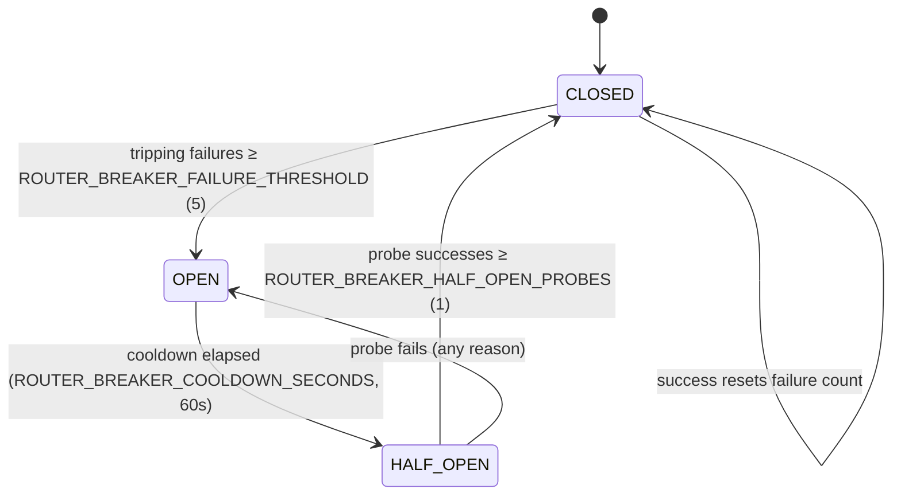

# Router Resilience Pack: Fail-Closed Circuit Breakers + Scoped Kill Switch

Two governance controls over the model-router's upstream dispatch, sharing one
posture: when something is wrong, **refuse loudly instead of rerouting
quietly**. Both live in `services/model-router/` as pure decision-logic modules
(`circuit_breaker.py`, `kill_switch.py`) wired into `main.py`'s dispatch paths,
following the same "module returns a verdict, host enforces" convention as
`budget_enforcement.py` and `waste_breakers.py`.

## 1. Why an agent platform needs this

A model router is the last place a bad upstream is cheap. Once a request
leaves it, every retry and every fallback hop is either latency the caller
pays for or tokens the operator pays for. Two boringly ordinary failures
dominate the cost tail:

1. **A credential goes bad** — rotated, revoked, expired. Every call to that
   endpoint 401s, and a router with automatic fallback does exactly what it
   was built to do: falls through to a *metered* model that works fine and
   bills fine. Nothing pages. The failure surfaces as an invoice.
2. **An endpoint exhausts quota or stops answering.** The retry loop turns one
   caller's request into several upstream round-trips before giving up, and an
   agent loop above the router multiplies that again.

Neither needs a human to diagnose. Both are countable, and both have the same
correct response: *stop calling that upstream for a while*. That is the
circuit breaker. The kill switch is the human-judgment complement: when an
operator decides paid dispatch must stop **now** — a runaway agent, a budget
incident, a compromised key — there is one scoped switch, not a redeploy.

This is the inverse of the classic availability-first breaker (Polly,
Hystrix, resilience4j), which fails *open* to keep serving traffic. An agent
platform's cost posture inverts the default: **fail closed**, because a
credential outage that silently falls through to metered inference turns an
ops problem into an invoice.

## 2. Circuit breaker state machine



- **CLOSED** — normal dispatch. Each *tripping* failure increments a counter;
  any success resets it (consecutive-failure semantics, not a rate).
- **OPEN** — the host returns a typed 503 with machine-readable code
  `UPSTREAM_BREAKER_OPEN` and does **not** invoke the upstream. No request may
  reach a dead credential while the breaker is open.
- **HALF_OPEN** — after the cooldown, exactly `HALF_OPEN_PROBES` real requests
  are admitted as probes. Success closes the breaker; failure — for *any*
  reason, including non-tripping ones (`half_open_probe_failed`) — reopens it.
  A probe admission is consumed exactly once; the wiring in `main.py` hands
  the admit verdict back to `_record_dispatch_outcome` so no path can consume
  a probe and then refuse to report it.

Every transition is logged (`circuit_breaker_transition`) and recorded to the
flight recorder as a `breaker_transition` event — a trip is a governance
event: it says the router stopped spending on an upstream, which is exactly
what an operator needs in the trace when they ask why traffic stopped.

## 3. Trip taxonomy — why narrow classification is the whole game

Classification is an explicit **allowlist**, never a "looks bad" heuristic:

| Signal | Trip reason | Rationale |
|---|---|---|
| HTTP 401 | `auth_failure` | Key missing, wrong, or revoked |
| HTTP 403 | `auth_failure` | Key valid but denied for the deployment |
| HTTP 429 | `quota_exhausted` | Rate/quota ceiling on this credential+endpoint |
| Connection-level exceptions (`APIConnectionError`, `APITimeoutError`, `ConnectError`, …) | `connection_failure` | Endpoint unreachable |

Explicitly **not** counted: model-content errors, empty or malformed
responses, 400/404/413/422 client errors, and 5xx application errors. Getting
this wrong is the single way this feature causes an outage instead of
preventing one — a breaker that counts "the model returned an empty string"
trips on perfectly healthy traffic that has nothing to do with the
credential. (The same lesson drove the upstream design this pack adapts:
typed false-success responses are the error taxonomy working correctly, and
they must never feed the breaker.)

An HTTP status the upstream actually returned is authoritative. Exception
class *names* are the fallback signal only when no status exists, so the
decision module stays stdlib-pure and never imports provider SDK exception
hierarchies.

## 4. Breaker key: credential identity, not tier name

Breakers are keyed by `credential_key(api_base, api_key)` — a stable hash of
the credential pair — not by tier/model name, because every signal in the trip
taxonomy belongs to the credential or its endpoint, not to a model's behavior:

- A revoked key 401s for **every** deployment it fronts; one breaker should
  open for all of them at once.
- Passthrough tiers are registered *ephemerally* (`select_tier()` writes
  `MODELS[<model string>]` on the fly). Keyed by name, a dead project
  credential could 401 forever without any single breaker accumulating enough
  failures to trip.
- All local Ollama tiers share one base URL and correctly share one breaker.

`/health` reports per-tier breaker state (several tiers can map to one
breaker), and `GET /debug/circuit-breakers` exposes the full per-key registry.

## 5. Fail-closed composition with fallback

`ROUTER_BREAKER_FAIL_CLOSED` (default **on**) is the seam between the two
controls: when a request's *primary* upstream breaker is OPEN, a **metered**
fallback hop is refused rather than attempted — the automatic version of
engaging `paid_fallback` for the duration of one request. Free local (Ollama)
tiers still serve: inference on an edge host the operator already owns has
zero marginal cost, so it is the recovery path a *cost* control must never
turn into an availability incident. An edge host going offline still degrades
to Foundry exactly the way it always did.

Gate ordering in `_resilience_gate()` is deliberate: **operator intent first
(kill switch), then automatic policy (fail-closed rule), then upstream health
(breaker admit)**. The breaker's `admit()` runs last because it is the only
step with a side effect — no path may consume a half-open probe and then
refuse the request for a different reason.

## 6. Scoped kill switch

Scopes, engaged in any combination:

| Scope | Blocks | Keeps working |
|---|---|---|
| `paid_fallback` | Fallback dispatch to metered models | Primary dispatch, free local tiers |
| `all_paid` | All metered dispatch | Free local tiers |

- **Boot-time posture:** `ROUTER_KILL_SWITCH_SCOPES` (comma-separated;
  unknown scope names are logged and ignored, never silently honored).
  Default empty — the kill switch is a deliberate incident action, not a
  posture.
- **Runtime control:** `POST /debug/kill-switch` with
  `{"scope", "action": "engage"|"release", "reason", "actor"}`. Both
  engagement and release are recorded to the flight recorder with actor and
  reason, so the post-incident question "who stopped paid dispatch, when, and
  why" has an answer that does not depend on anyone remembering.
- **Refusal shape:** affected requests get a typed 503 with code
  `PAID_ACTIONS_DISABLED` naming the engaged scope — machine-readable for the
  agent runtime, self-explanatory for a human reading logs.

### Operator workflow

```bash
# What's the current posture?
curl -H "Authorization: Bearer $ROUTER_API_KEY" http://localhost:8080/debug/kill-switch

# Incident: stop paid fallback, leave subscription/local paths serving
curl -X POST -H "Authorization: Bearer $ROUTER_API_KEY" -H "Content-Type: application/json" \
  -d '{"scope": "paid_fallback", "action": "engage", "reason": "runaway loop, issue #42", "actor": "michael"}' \
  http://localhost:8080/debug/kill-switch

# After the fix: release, and clear any breakers opened during the incident
curl -X POST -H "Authorization: Bearer $ROUTER_API_KEY" -H "Content-Type: application/json" \
  -d '{"scope": "paid_fallback", "action": "release", "reason": "fixed", "actor": "michael"}' \
  http://localhost:8080/debug/kill-switch
curl -X POST -H "Authorization: Bearer $ROUTER_API_KEY" \
  http://localhost:8080/debug/circuit-breakers/reset
```

State-changing routes (`POST /debug/kill-switch`,
`POST /debug/circuit-breakers/reset`) require the ordinary router credential
and — when `ROUTER_ADMIN_API_KEY` is set — an additional `X-Router-Admin-Key`
header, separating "may call the router" from "may turn the router's spend
controls off". Unset, they behave like the existing `/debug/*` routes so the
feature works out of the box; a deployment where every agent holds
`ROUTER_API_KEY` should set it.

## 7. Configuration reference

| Env var | Default | Meaning |
|---|---|---|
| `ROUTER_BREAKER_ENABLED` | `true` | Evaluate breakers on upstream dispatch (fail-safe by construction — only stops calls already failing the allowlist) |
| `ROUTER_BREAKER_FAILURE_THRESHOLD` | `5` | Consecutive tripping failures before OPEN |
| `ROUTER_BREAKER_COOLDOWN_SECONDS` | `60` | OPEN duration before a half-open probe |
| `ROUTER_BREAKER_HALF_OPEN_PROBES` | `1` | Probe successes required to close |
| `ROUTER_BREAKER_FAIL_CLOSED` | `true` | Refuse metered fallback while the primary's breaker is OPEN |
| `ROUTER_KILL_SWITCH_SCOPES` | (empty) | Scopes engaged at boot |
| `ROUTER_ADMIN_API_KEY` | (unset) | Second credential for state-changing operator routes |

Machine-readable refusal codes: `UPSTREAM_BREAKER_OPEN` (breaker),
`PAID_ACTIONS_DISABLED` (kill switch) — same convention as
`budget_exceeded` and `waste_breaker_tripped`.

## 8. What this teaches (for readers learning agentic AI governance)

- **Cost posture inverts the classic breaker default.** Availability-first
  systems fail open; agent platforms whose failure mode is "silently spend
  more" fail closed. Decide which failure you can afford before picking a
  default.
- **Trip taxonomy is a security boundary.** The narrower the classification,
  the safer the automation. Every signal admitted to the allowlist is a new
  way healthy traffic can be refused.
- **Key by how failures propagate, not by how config is named.** Credentials
  fail; model names don't.
- **Automatic controls need a human-scoped complement.** The breaker handles
  the countable failures; the kill switch handles the judgment calls — and
  both write to the same flight-recorder trace, so the audit story is one
  story.

## 9. Known gaps / follow-ups

- Breaker and kill-switch state is per-process; a multi-replica router gets
  independent judgment per replica (same posture as the flight recorder).
- No automatic escalation from waste-breaker trips to kill-switch engagement;
  an operator (or an external watchdog alert) closes that loop today.
- `/v1/embeddings` dispatch is not breaker-gated (matches the flight-recorder
  scope cut).
