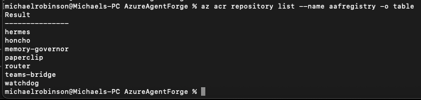
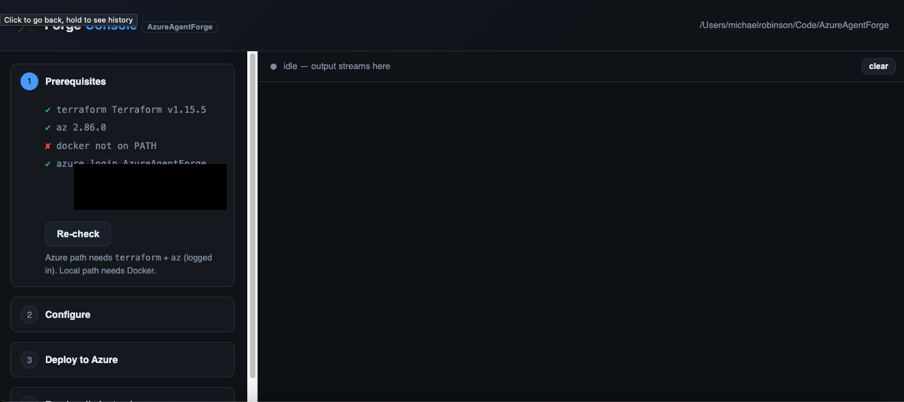
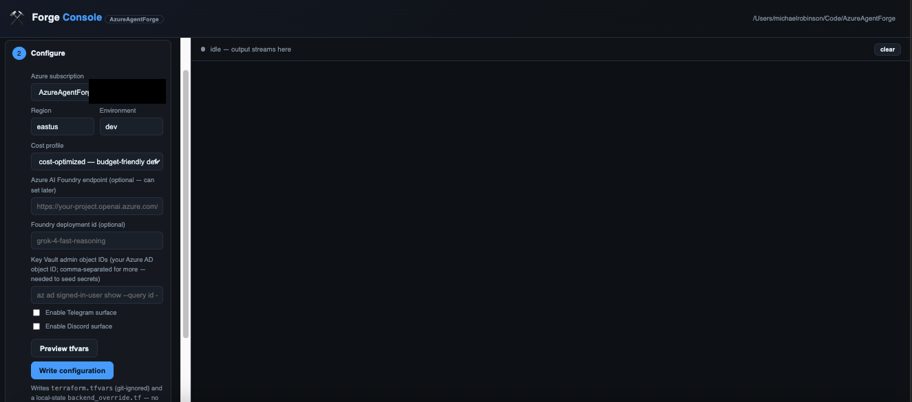
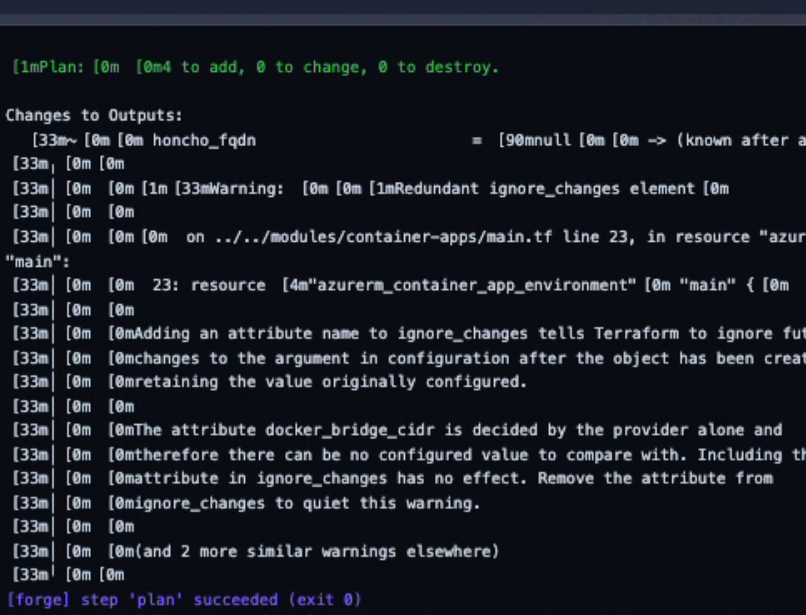
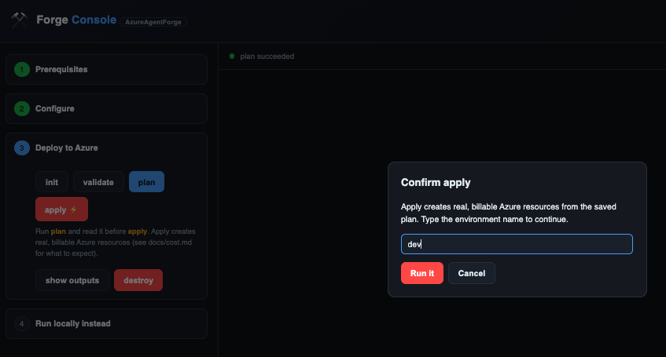
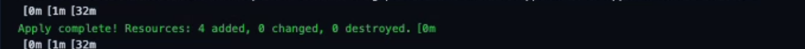
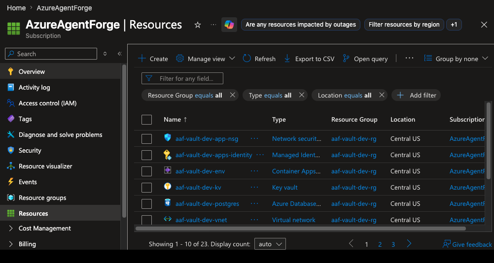
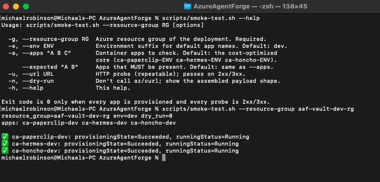

<p align="center">
  <picture>
    <source media="(prefers-color-scheme: dark)" srcset="assets/azureagentforge-logo-dark.png">
    
  </picture>
</p>

# Getting started

AzureAgentForge runs on four services: a PostgreSQL database with pgvector, a
model-router that normalises requests to your LLM endpoint, a Honcho memory
layer, and a Paperclip orchestrator. You can run all four locally with Docker
Compose or deploy them to Azure Container Apps with Terraform.

New to these names? The [README's component table](../README.md#the-components) explains what each one is in plain words, and the [glossary](GLOSSARY.md) defines any unfamiliar term below.

Pick a path:

- **Path 0, Forge Console (recommended).** Run `./forge` from the repo root
  and a local web console handles both paths below: prerequisite checks, a
  configuration form, and live-streamed Terraform runs (or the Docker Compose
  working slice). See [`installer/README.md`](../installer/README.md).
- **Path A, local first.** Good for exploring the codebase or iterating on
  agents before touching Azure. Requires Docker and an LLM endpoint (Azure AI
  Foundry or any OpenAI-compatible API).
- **Path B, deploy to Azure.** Provisions the full infrastructure: Container
  Registry, PostgreSQL Flexible Server, Key Vault, Container Apps, and
  optional monitoring. Requires an Azure subscription, `az` CLI, and
  Terraform >= 1.5.

---

## Prerequisites

| Requirement | Notes |
|---|---|
| Azure subscription | Only required for Path B and for Azure AI Foundry endpoints |
| `az` CLI, logged in | `az login && az account set --subscription <id>` |
| Terraform >= 1.5 | Path B only |
| Docker Desktop | Path A; Docker Compose ships with it |
| LLM endpoint | Azure AI Foundry (primary) or any OpenAI-compatible base URL |

The local router registers a `gpt4o-mini` primary tier when you provide either
the `AZURE_FOUNDRY_*` pair or the direct `GPT4O_*` pair (the former is aliased
to the latter in `docker-compose.yml`). Point either at any OpenAI-compatible
endpoint: Azure AI Foundry, Ollama, vLLM, or a hosted API. Optional tiers
(Grok, Kimi, Claude, Phi) register only when their own env vars are set.

---

## Path A - run it locally

### 1. Copy and fill the environment file

```bash
cp .env.example .env
```

Open `.env` and fill in the variables for your LLM provider. The minimum
set for Azure AI Foundry:

```
LLM_PROVIDER=azure_foundry
AZURE_FOUNDRY_ENDPOINT=https://<your-project>.openai.azure.com/
AZURE_FOUNDRY_API_KEY=<your-key>
```

Or point the primary tier at any OpenAI-compatible endpoint:

```
GPT4O_BASE_URL=http://localhost:11434/v1   # example: local Ollama/vLLM
GPT4O_API_KEY=ollama                        # placeholder if not required
```

The Postgres defaults (`POSTGRES_USER=aaf`, `POSTGRES_PASSWORD=localdev`,
`POSTGRES_DB=aaf`) are fine for local development and are already baked into
the Compose file. You do not need to set them unless you want different values.

Leave `TELEGRAM_BOT_TOKEN` and `DISCORD_BOT_TOKEN` empty unless you are
testing bot surfaces locally.

### 2. Start the stack

```bash
docker compose up
```

`docker compose up` builds and starts two services: postgres and the
model-router (from `services/model-router`). Set LLM credentials in `.env` and
the router registers a tier on startup; leave them blank and it starts with no
tiers but still accepts requests on port 8080.

| Service | URL | Purpose |
|---|---|---|
| model-router | http://localhost:8080 | LLM proxy |
| postgres | localhost:5432 | Database with pgvector |

PaperClip and Honcho sit behind the `full` Compose profile. Their Dockerfiles
build from upstream sources (paperclipai/paperclip, plastic-labs/honcho) not
included in this repo; you need to clone those first. The full local stack with
PaperClip at localhost:3099 is a one-command experience (`scripts/local-stack.sh up`).
See [ROADMAP.md](../ROADMAP.md).

### 3. Add agents and connect chat surfaces

- To modify or add agent roles, see [`../agents/README.md`](../agents/README.md).
- To connect a Telegram bot, see [`../integrations/telegram/README.md`](../integrations/telegram/README.md).
- To connect a Discord bot, see [`../integrations/discord/README.md`](../integrations/discord/README.md).

---

## Path B - deploy to Azure

### 1. Clone and enter the dev environment

```bash
git clone https://github.com/mrobinson2/AzureAgentForge.git
cd AzureAgentForge/infrastructure/environments/dev
```

### 2. Configure Terraform state (or skip it for a dry run)

`backend.tf` is pre-configured for an Azure Storage Account backend. Before
running `terraform init` against real state, edit `backend.tf` and replace the
placeholder values:

```hcl
resource_group_name  = "rg-terraform-state"
storage_account_name = "YOUR_TF_STATE_STORAGE_ACCOUNT"
subscription_id      = "00000000-0000-0000-0000-000000000000"
tenant_id            = "00000000-0000-0000-0000-000000000000"
```

For a dry run that skips remote state entirely:

```bash
terraform init -backend=false
```

For a real deploy, create the storage account first, then:

```bash
terraform init
```

### 3. Create your terraform.tfvars

```bash
cp ../../terraform.tfvars.example terraform.tfvars
```

`terraform.tfvars.example` contains:

```hcl
subscription_id = ""   # az account show --query id -o tsv
location        = "eastus"
environment     = "dev"
# Optional surfaces (all default off)
telegram_enabled = false
discord_enabled  = false
```

Fill in your `subscription_id`. Change `location` if you want a different
Azure region.

**Globally-unique names.** Three resources need names unique across all of Azure:
the Container Registry (`container_registry_name`, default `"aafregistry"`), the
Key Vault, and the storage account. The latter two derive from `project_name`
(default `"aaf-vault"` → `aaf-vault-<env>-kv` and `aafvault<env>sa`). The defaults
**will collide** with other adopters, so set `project_name` and
`container_registry_name` in `terraform.tfvars` to values unique to your
subscription. `scripts/bootstrap.sh` preflights all three up front and tells you
exactly which one to change if it's already taken.

### 4. Choose a cost profile

Two profiles live in `../../profiles/`:

| Profile | Approx. monthly infra cost | Key trade-offs |
|---|---|---|
| `cost-optimized.tfvars` | < $150 | B1ms Postgres, no HA, 30-day logs, public Key Vault endpoint |
| `hardened.tfvars` | ~$250+ | B2s Postgres, zone-redundant HA, 90-day logs, private Key Vault endpoint |

LLM token usage is billed separately and is not included in those figures.

### 5. Plan and apply

> **First deploy?** The Key Vault module reads `postgres-admin-password` as a
> data source, so the *first* `terraform plan` fails until that secret exists.
> The simplest path is the one-time bootstrap, which creates the vault, seeds the
> secret, and runs the full apply for you:
>
> ```bash
> scripts/bootstrap.sh --apply
> ```
>
> Prefer to drive Terraform by hand? Seed `postgres-admin-password` first (see
> [deploy-pipeline.md](deploy-pipeline.md#first-deploy-a-one-time-key-vault-bootstrap)),
> then the commands below are your steady-state loop.

```bash
terraform plan \
  -var-file=../../profiles/cost-optimized.tfvars \
  -var-file=terraform.tfvars

terraform apply \
  -var-file=../../profiles/cost-optimized.tfvars \
  -var-file=terraform.tfvars
```

Terraform provisions a resource group, virtual network, Key Vault, Container
Registry, PostgreSQL Flexible Server, Container Apps environment, and (if
enabled) a monitoring workspace. The apply takes roughly 15-20 minutes on a
fresh subscription.

> **Destroy-aware applies.** Adds and in-place changes apply normally. But a
> plan that would *delete* or *replace* an existing resource is destructive,
> and the Forge Console blocks it behind a second, explicit approval (the GUI
> lists the affected resources and asks you to type `approve-destroy`, separate
> from the environment-name confirmation). On the command line you get the same
> safety by always reviewing `terraform plan` output before apply, or by saving
> and inspecting a plan file:
>
> ```bash
> terraform plan -out tfplan \
>   -var-file=../../profiles/cost-optimized.tfvars -var-file=terraform.tfvars
> # Any "destroy" / "replace" in the plan? Treat it as a separate decision.
> terraform show -json tfplan | jq '[.resource_changes[]
>   | select(.change.actions | index("delete")) | .address]'
> terraform apply tfplan   # applies the saved plan only
> ```
>
> If you deploy from your own CI/CD pipeline, mirror the gate there: run
> `terraform plan -out tfplan`, fail-fast or require a manual approval when the
> JSON above is non-empty, and apply the *saved* plan so what you reviewed is
> exactly what runs. See [docs/security.md](security.md) for the rationale.

This step provisions infrastructure. It does not build or push service images.
Image build, push, and service startup are automated in v1.2 via
`scripts/build-and-push.sh` and the Forge Console. See [ROADMAP.md](../ROADMAP.md).

### 6. Seed Key Vault secrets

After apply, the Container Apps pull secrets from Key Vault by name. Seed them
with [`scripts/seed-keyvault.sh`](../scripts/seed-keyvault.sh); it generates the
internal secrets (JWT keys, admin passwords) and reads external ones (provider
keys, bot tokens, the Postgres connection strings) from like-named environment
variables:

```bash
KV=$(terraform output -raw key_vault_name)

# Pass the keys/tokens you have; an unset external gets a non-empty `__unset__`
# placeholder and stays inert until you set it and re-run. The Postgres
# connection strings are a SECOND pass: they can only be known now that the
# database exists, so derive them from your Postgres resource.
AI_FOUNDRY_API_KEY="<your-key>" \
POSTGRES_CONNECTION_STRING="<from your Postgres resource>" \
PAPERCLIP_DB_URL="<from your Postgres resource>" \
  scripts/seed-keyvault.sh -v "$KV"
```

`scripts/seed-keyvault.sh --list` prints the full inventory and the env var each
secret reads. Note the Azure AI Foundry **endpoint** is *not* a Key Vault secret;
it is the `ai_foundry_endpoint` Terraform variable (set in `terraform.tfvars`
or the Forge form). Only the API key (`ai-foundry-api-key`) is a secret.

### 7. After deploy

The Terraform outputs include the Paperclip public URL:

```bash
terraform output paperclip_fqdn
```

Open that URL to reach the orchestrator UI.

From here, the same steps as the local path apply:

- Add or modify agents: [`../agents/README.md`](../agents/README.md)
- Enable Telegram: [`../integrations/telegram/README.md`](../integrations/telegram/README.md)
- Enable Discord: [`../integrations/discord/README.md`](../integrations/discord/README.md)
- Enable Teams: [`../integrations/teams/README.md`](../integrations/teams/README.md)
- Public ingress or a chat surface going live (e.g. Teams) needs a Cloudflare tunnel and DNS, managed by the `cloudflare-tunnel` Terraform module under `infrastructure/modules/`.

---

## Honest expectations

This stack runs in production on Azure; it is a proven platform, and this repo
is its sanitized, reusable version. What's left to you is setup, not whether it
works: a clean clone validates and plans without errors; `docker compose up`
starts postgres and model-router (the full local stack needs `--profile full`
and upstream sources, brought up with one command via `scripts/local-stack.sh up`);
and `terraform apply` provisions the infrastructure. Building and pushing the
service images and seeding secrets are automated in v1.2 (`scripts/build-and-push.sh`,
`scripts/seed-keyvault.sh`, and the Forge Console / reference deploy pipeline);
wiring GitHub-to-Azure IAM (OIDC) is the one piece still yours to set up once. The cloud prerequisites (your Azure subscription, an AI
Foundry project or substitute endpoint, and Terraform state storage) are yours to
provide. Cost figures are estimates pending your own bill.

## Deployment walkthrough (Forge Console)

A full end-to-end deploy of the cloud stack from a **clean subscription** via the
Forge Console (`PYTHON=python3.13 ./forge`). Image builds run server-side in ACR
(`az acr build`), so no local Docker is required.

1. **Build and push the images** with `scripts/build-and-push.sh` (server-side `az acr build`; run `--list` first to preview the seven images):
   
2. **Preflight checks**: Terraform, `az` login, and subscription detection:
   
3. **Configuration wizard**: the tfvars form with live preview:
   
4. **Plan**: live-streamed `terraform plan`:
   
5. **Destroy-aware apply gate**: typed confirmation; routine changes apply, any delete/replace blocks:
   
6. **Apply complete**: infrastructure provisioned:
   
7. **Running stack**: the resource group with the Container Apps environment and the deployed apps:
   
8. **Post-deploy smoke and live UI**: `scripts/smoke-test.sh` PASS and the PaperClip UI over the Cloudflare tunnel:
   

> Key Vault is seeded with `scripts/seed-keyvault.sh` (the generate-class secrets,
> incl. `postgres-admin-password`, must exist before the first `terraform apply`).
> The same flow runs unattended via the [reference deploy pipeline](deploy-pipeline.md).

### Deploy inputs: how to obtain each one

Everything the Forge form (and `terraform.tfvars`) asks for, and where each value
comes from. Fill these in and you won't need to hand-edit `terraform.tfvars`:

| Input | What it is | How to get it |
|---|---|---|
| `subscription_id` | Your Azure subscription GUID | `az account show --query id -o tsv` |
| `ai_foundry_endpoint` | The Azure AI Foundry project endpoint URL | Portal → your Foundry / AI Services resource → **Endpoint**, e.g. `https://<name>.cognitiveservices.azure.com/` |
| `ai_foundry_deployment_id` | The **name of a model deployment** you created in Foundry (e.g. `gpt-4o-mini`), a deployment name and **not** a GUID. Defaults to `gpt-4o-mini`. | `az cognitiveservices account deployment list -n <foundry> -g <rg> -o table` |
| `keyvault_admin_object_ids` | Your Entra **object id**, granted Key Vault Secrets Officer so the seed step can write secrets (without it the seed 403s) | `az ad signed-in-user show --query id -o tsv` (or a service principal's object id) |
| Container image tag | The commit short-SHA `scripts/build-and-push.sh` pushes (e.g. `9bf1a51`); blank uses `latest`. The Forge **Container image tag** field fans one tag out to all four service images. | `git rev-parse --short HEAD`, or `az acr repository show-tags -n <registry> --repository paperclip --orderby time_desc --top 1 -o tsv` |

### Defaults you must override for a real deploy

A few config defaults are tuned for **local development** and are replaced with
real values automatically when you deploy to Azure (Terraform sets them on the
Container Apps), so you normally don't touch them. Know about these if you wire a
container up by hand outside the provided Terraform:

- **`PAPERCLIP_PUBLIC_URL`** / **`PAPERCLIP_ALLOWED_HOSTNAMES`** default to
  `localhost` for the local stack; the Azure deploy sets them to your real public
  URL (the Cloudflare-tunnel hostname). Point them at your FQDN for any hand-rolled
  deploy.
- **Service endpoints** (`OPENAI_BASE_URL`, `HONCHO_BASE_URL`, `GOVERNOR_BASE_URL`)
  default to `localhost` ports under Compose and to cluster-internal names on
  Azure; the deploy wires the cluster-internal names for you.

Key Vault secret names are kept consistent across what `scripts/seed-keyvault.sh`
seeds, what the container-apps modules reference, and what `data.tf` reads, so a
fresh deploy resolves every secret reference without manual reconciliation.
