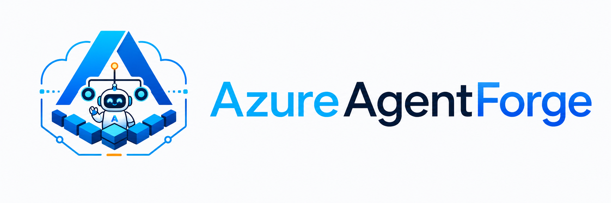

  <picture>
    <source media="(prefers-color-scheme: dark)" srcset="../../docs/assets/azureagentforge-logo-dark.png">
    
  </picture>

# Multi-Tenant Roadmap

> **Technical reference for contributors.** For the operational overview, start at [README](../../README.md) or [Architecture](../../docs/architecture.md).

> 🚧 **Design target — not deployed.** This is a reference architecture for multi-tenancy. The single-tenant stack in this repository is what actually deploys and what CI validates. The multi-tenant *design* is ~complete; the *implementation* is partial (~20–30%) and has never been deployed. Treat this as a roadmap, not a shipped feature.

## Maturity

| Dimension | Status |
|-----------|--------|
| Design | ~complete (see `ARCHITECTURE.md`) |
| Implementation | ~20–30% (scaffolding only) |
| Deployed / validated | Never |
| Runnable path | Single-tenant stack (`docker-compose.yml`, `infrastructure/`) |

The single-tenant stack is what CI validates and what actually runs. Nothing in this directory is wired into `docker-compose.yml` or the Terraform environment modules.

## What's here

| Path | What it is |
|------|-----------|
| `ARCHITECTURE.md` | Full reference design: isolation strategy, data-layer changes, agent routing, Terraform module design, onboarding flow, cost model, security controls, and migration plan. Start here. |
| `control-plane/` | Tenant provisioning plus durable daily-budget reservations, onboarding checkpoints, signed-principal/RLS binding, and operator audit endpoints (FastAPI + PostgreSQL). **Reference only — not deployed.** |
| `memory-store/` | Scaffolding for a per-tenant memory service (FastAPI + pgvector). Covers vector insert/search/delete endpoints. **Reference only — not wired in.** |
| `tenant-console/` | Scaffolding for playbook-driven tenant onboarding: a headless provision/decommission executor, an operator GUI (FastAPI + SSE, Forge Console pattern), a vertical playbook pack, and per-tenant budget/memory seams. **Reference only — not wired in.** |

## Designed vs Built

### Designed (complete)

- Schema-per-tenant with PostgreSQL row-level security (RLS)
- Per-tenant budget tracking in the model router
- Per-tenant agent routing via Cloudflare wildcard DNS
- Tenant onboarding flow (API + Terraform + Key Vault seeding)
- Terraform tenant module (`azurerm_user_assigned_identity`, file share, RBAC, optional dedicated Hermes container)
- Audit logging schema and triggers
- Cross-tenant prevention checklist and penetration-testing queries

### Built (reference implementation)

- Control-plane API: tenant CRUD, resumable onboarding, atomic daily-budget
  reserve/settle/release operations, and operator budget-event inspection
- Model-router integration: signed tenant principal verification and
  reserve-before-provider/settle-after-provider for non-streaming chat
- Memory-store service: vector insert/search/delete endpoints (FastAPI, untested)
- SQL schema for tenant records and memory records
- Tenant console (playbook-driven onboarding, per-tenant budget, operator UI): headless executor + FastAPI/SSE GUI + example vertical pack (offline-testable, not deployed)

### Not built / not deployed

- Live RLS policies applied to the running database
- Applied per-tenant Terraform module (no second tenant has ever been provisioned)
- Validated end-to-end onboarding of a second tenant
- Cloudflare wildcard DNS configured for tenant routing
- Per-tenant Key Vault secret naming enforced in production

## Migration path

Implementation follows four broad phases:

1. **Foundation** — Add `tenant_id` column to all tables; apply RLS policies; provision the initial tenant record via the control-plane API.
2. **Router + agents** — Propagate signed control-plane user tokens to the model
   router; enable durable per-tenant reservations; configure tenant-scoped
   Honcho app IDs in Hermes.
3. **Routing + orchestrator** — Configure Cloudflare wildcard DNS; add tenant-resolver middleware to Paperclip; extend the onboarding API to trigger Terraform.
4. **Production + second tenant** — Apply the Terraform tenant module; seed Key Vault secrets; validate a second tenant end-to-end; enable audit log.

Each phase has a defined rollback path documented in `ARCHITECTURE.md` section 12.

## Closing note

Do not expect this to run as-is. It is intentionally NOT part of `docker-compose.yml` or the Terraform stack. To pursue multi-tenancy, start from `ARCHITECTURE.md`.
