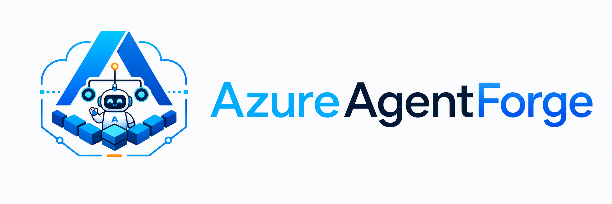

<p align="center">
  <picture>
    <source media="(prefers-color-scheme: dark)" srcset="../../../docs/assets/azureagentforge-logo-dark.png">
    
  </picture>
</p>

# Tenant Console

> **Technical reference for contributors.** For the operational overview, start at [README](../../../README.md) or [Architecture](../../../docs/architecture.md).

> 🚧 **Reference scaffolding — not deployed.** Part of the multi-tenant roadmap (see ../README.md). Not wired into the compose stack or Terraform.

Playbook-driven tenant onboarding for a shared agent stack. One tenant = one row
of config; the executor turns that contract into a PaperClip company, an intake
(Band-1) and coordinator (Band-2) agent, a workspace-partitioned memory
namespace (`tenant-<slug>`), per-tenant budgets, and channel bindings — on the
**existing** stack, with no new infra per tenant. It follows the
[Forge Console](../../../installer/) pattern: a loopback-only local web GUI,
per-session token, preview-first, SSE-streamed steps behind typed-confirmation
gates, over a headless executor a CLI can drive too.

This is a sanitized, generic reference lifted from a private single-operator
platform. The example vertical (`playbooks/example-fieldservice/`) is an
invented field-service inspection business — it demonstrates the pack mechanism,
not a real product.

## Layout

| Path | What it is |
|------|-----------|
| `src/tenantconsole/` | The headless executor: `contract` → `client` → `steps` (provision) / `decommission`, plus `playbook` (pack loader/renderer) and `jwt_mint`. Pure orchestration; stdlib + PyYAML + requests. |
| `console/` | The operator GUI: FastAPI app (`app.py`), threaded SSE `runner.py`, single-file `static/index.html`. Loopback-only + per-session token. |
| `playbooks/example-fieldservice/` | The example vertical pack: `pack.yaml` manifest, two agent AGENTS.md templates, one intake skill, seed memories, and a smoke-conversation fixture — all `{{variable}}`-templated. |
| `examples/example-fieldservice.yaml` | A worked tenant contract that renders end-to-end unedited. |
| `scripts/` | `tenant-console` launcher + an early reference `provision_tenant.py`. |
| `provision_tenant.py` | An early reference executor (kept for provenance; superseded by `src/tenantconsole/`). |
| `tests/` | Reference tests for the per-tenant budget ledger and the auth-proxy governor seams. They target seams the public stack does not vendor, so they document contracts rather than run as-is. |
| `DESIGN.md` | The design: what a tenant is, the shared-stack-first decision, the console, the vertical pack model, phasing, and non-goals. |
| `RUNBOOK.md` | How to author a contract, dry-run, provision, and decommission. |

## What a tenant is

```yaml
tenant:
  slug: "example-fieldservice"     # DNS-safe, immutable → workspace tenant-example-fieldservice
  display_name: "Acme Field Services"
  vertical: "example-fieldservice" # selects the playbook pack
  budgets:
    daily_usd: 5.00                 # router per-tenant daily cap
    per_run_usd: 0.50               # per-run cost envelope
  variables:                        # only the wizard-collected pack variables
    service_area: "the Example metro area"
    ...
  channels:
    - kind: external_webhook        # recorded pending in P1
    - kind: paperclip-issues        # bound now
```

Provisioning executes that contract idempotently: create the company + agents,
upload the rendered playbook AGENTS.md, seed the tenant's pinned memories,
register the per-tenant budget, bind channels, then run a smoke conversation
against the intake agent. Every step converges on re-run.

## Status

Design ~complete; executor + console built and offline-testable in the source
project, but this port is **not** wired into the AzureAgentForge compose stack
or Terraform and has never been deployed here. Treat it as a reference.
